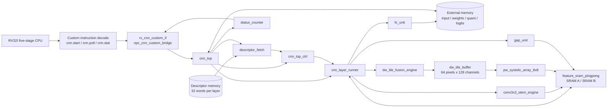
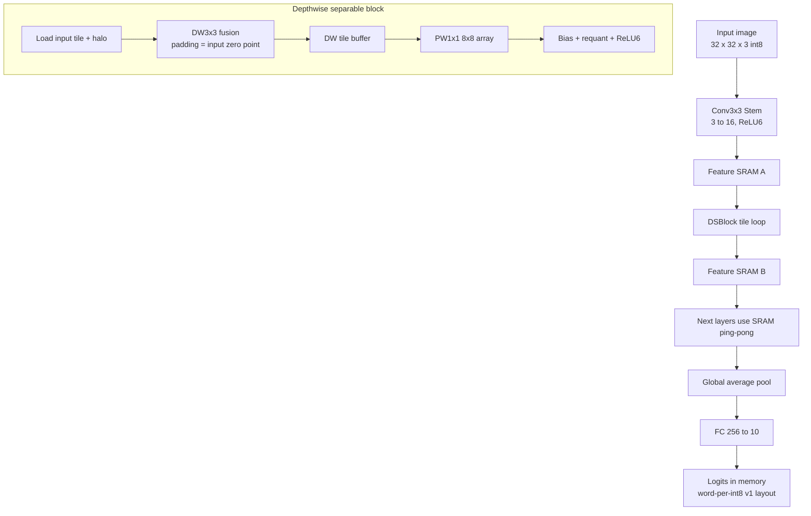

# Architecture and Verification Diagrams

This note keeps the project diagrams in text form so they can be versioned, reviewed, and copied into reports or slides.

## Accelerator Architecture

Key point: DW3x3 intermediate data is not written back to external memory. The DW tile output is kept in `dw_tile_buffer`, then consumed by PW1x1.

## Datapath View

## Verification Closure

```mermaid
flowchart LR
    TORCH[PyTorch / Numpy training] --> EXPORT[quantize_export.py<br/>int8 weights, bias, qparams]
    EXPORT --> GOLDEN[golden_int8.py<br/>bit-exact software model]
    GOLDEN --> VEC[generate_test_vectors.py<br/>descriptor + memory image + expected]
    VEC --> RTL[RTL testbenches]
    RTL --> VERILATOR[Verilator simulation]
    VERILATOR --> CMP[logits compare<br/>expected vs actual]
    CMP --> FW[Firmware / CPU joint sim<br/>custom start, poll, stat]
    FW --> REPORT[accuracy + cycle reports]
```

Current full-network smoke checks compare all 10 logits element by element, then check the CPU-observed argmax path.

